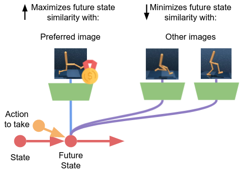
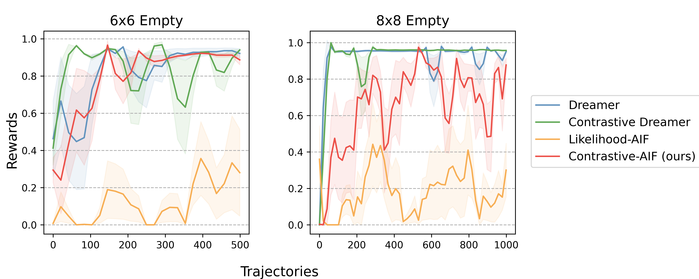
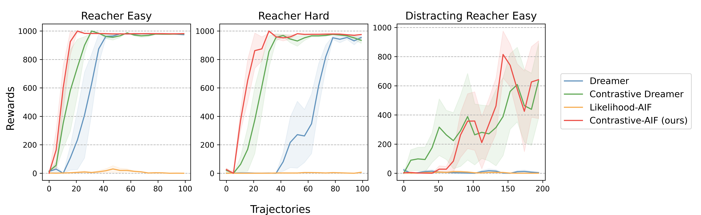

# Contrastive Active Inference
[[website](https://contrastive-aif.github.io/)] [[paper](https://arxiv.org/abs/2110.10083)]


This repository is the official implementation of Contrastive Active Inference (NeurIPS 2021).

<p align="center">
    
</p>


If you find the code useful, please refer to our work using:

```
@inproceedings{Mazzaglia2021ContrastiveAIF,
	title = {Contrastive Active Inference},
	author = {Pietro Mazzaglia and Tim Verbelen and Bart Dhoedt},
	booktitle = {Advances in Neural Information Processing Systems},
	year = {2021},
	url = {https://openreview.net/forum?id=5t5FPwzE6mq}
}
```

## Dependencies

[RECOMMENDED] Create and activate a conda environment running:

```bash
conda create -n contrastive-aif python=3.8`
conda activate contrastive-aif
```

To install dependencies, please run:

`pip install -r requirements.txt`

Note: for the experiments on the Deep Mind Control Suite, you will need a licensed copy of Mujoco and to install the `dm_control` package.

NOTE: new versions of `dm_control` automatically install Mujoco with free license. However, these haven't been tested.

## Train Code

To run experiments you can use one the following:

Minigrid:
```
python main.py --suite minigrid_pixels --task empty --config minigrid_empty_8x8 --algo contrastive_actinf --seed 34
```

Reacher:
```
python main.py --suite dmc --task reacher_easy_13 --config dmc_small dmc_benchmark --algo contrastive_actinf --seed 34
```


#### Paper Results


</img></a>


</img></a>

### Acknowledgments

We would like to thank the authors of the following repositories for their useful open source code:

[Dreamer](https://github.com/danijar/dreamer) [TensorFlow implementation of Dreamer]
[dreamer-pytorch](https://github.com/juliusfrost/dreamer-pytorch) [PyTorch implementation of Dreamer]